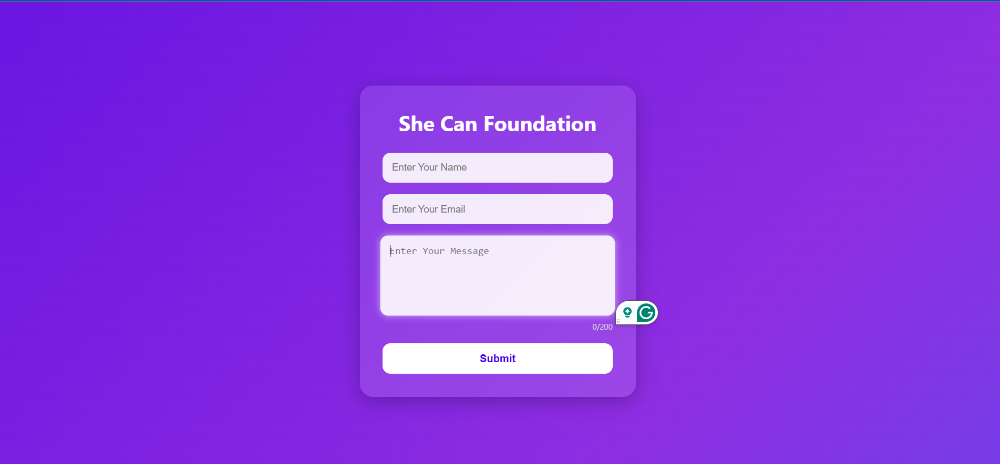
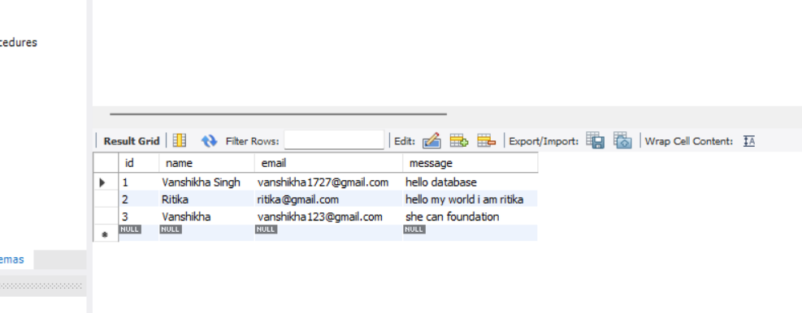

# She Can Foundation Contact Form

A responsive Full Stack Contact Form Web Application developed for the She Can Foundation Internship Task.

##  Features

* Responsive and modern UI
* Contact form with:

  * Name field
  * Email field
  * Message field
* Client-side form validation
* Character counter for message input
* Loading state during submission
* Success/Error notifications
* REST API integration
* MySQL database connectivity
* Stores user submissions in database

## Tech Stack

### Frontend

* HTML5
* CSS3
* JavaScript

### Backend

* Node.js
* Express.js

### Database

* MySQL

## 📂 Project Structure

```text
SheCanFoundation/
│
├── public/
│   ├── index.html
│   ├── style.css
│   └── script.js
│
├── server.js
├── package.json
└── README.md
```

## ⚙️ Installation & Setup

### 1. Clone Repository

```bash
git clone https://github.com/your-username/fullstack-contact-management-system
.git
```

### 2. Navigate to Project Folder

```bash
cd fullstack-contact-management-system

```

### 3. Install Dependencies

```bash
npm install
```

### 4. Configure MySQL

Create a database:

```sql
CREATE DATABASE shecan_db;
```

Use database:

```sql
USE shecan_db;
```

Create table:

```sql
CREATE TABLE contacts (
    id INT AUTO_INCREMENT PRIMARY KEY,
    name VARCHAR(100),
    email VARCHAR(100),
    message TEXT
);
```

### 5. Update Database Credentials

In `server.js`, update:

```javascript
const db = mysql.createConnection({
    host: "localhost",
    user: "root",
    password: "YOUR_PASSWORD",
    database: "shecan_db"
});
```

### 6. Run Application

```bash
node server.js
```

Open:

```text
http://localhost:3000
```

##  Database Schema

| Column  | Type         |
| ------- | ------------ |
| id      | INT          |
| name    | VARCHAR(100) |
| email   | VARCHAR(100) |
| message | TEXT         |

## Learning Outcomes

* Full Stack Web Development
* REST API Development
* Express.js Backend Development
* MySQL Database Integration
* Form Validation
* Client-Server Communication
* Responsive Web Design

##  Screenshots

### Homepage


### Database Records

